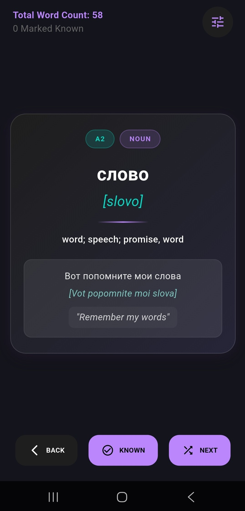
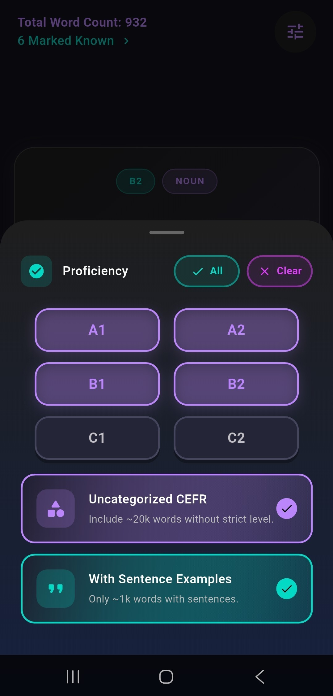
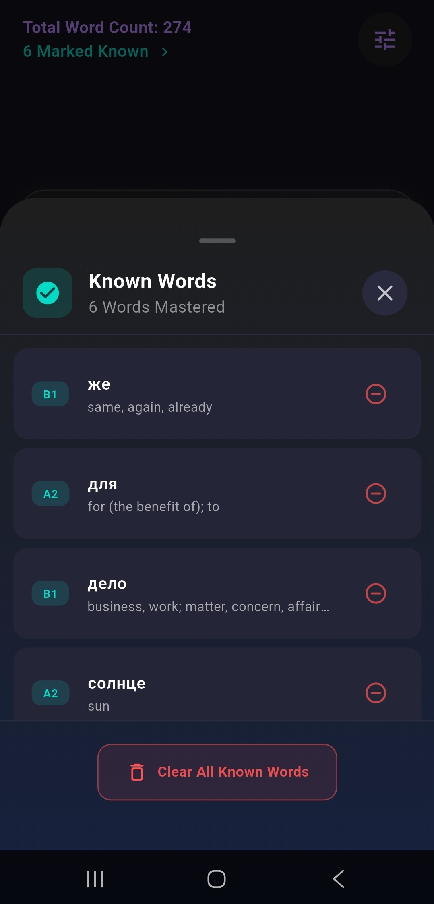
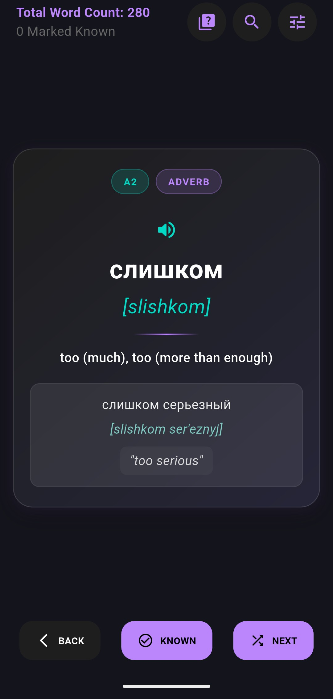
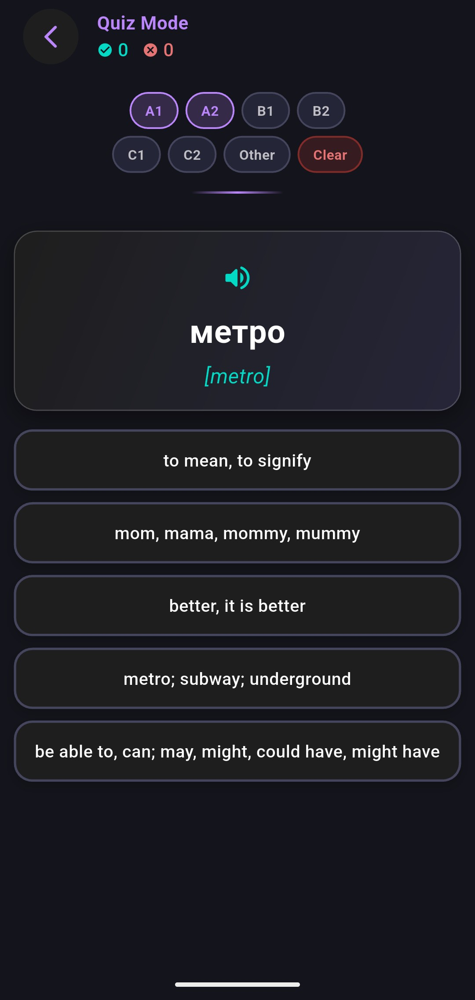
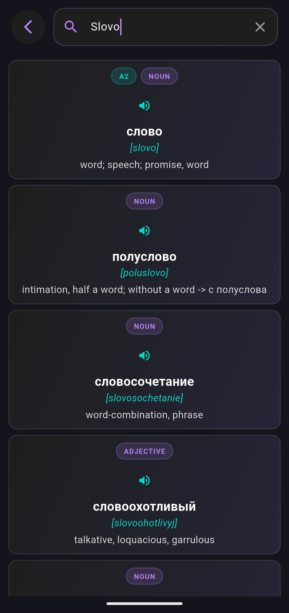

# 📘 Vocabrulary
* Vocabrulary is a Flutter app that helps you study Russian through clean, focused vocabulary cards. 

# 📇 Cards
* Master new words through a distraction-free interface.
* Each card presents the Russian word, its transliteration, and its English meaning.

# 🧠 Quiz Mode
* Test your knowledge and track your progress.
* Each question presents a Russian word in Cyrillic and 5 English definition choices.
* Proficiency Levels: Questions range from A1 (Beginner) to C2 (Advanced).

# 🔍 Smart Dictionary Search
* Search for words easily, even if you don't have a Russian keyboard installed.
* Type phonetic approximations or exact definitions, `Water` or `Voda` inputs to find the entry for `вода`.
* Dual-Input Support: Search using standard Cyrillic or Latin characters.

# 📚 Data Source & Processing
* This project uses vocabulary data compiled by: **Holence/OpenRussian_MDict** which is based on the publicly available CSV files of **OpenRussian (en.openrussian.org)**. 
`[https://app.togetherdb.com/db/fwoedz5fvtwvq03v/openrussian_public/]`
* Merged and cleaned entries from the original OpenRussian CSV datasets.
* Filtered down to words that have valid English translations.
* Generated the transliteration field using the `transliterate` Python library.
* The Python script for this workflow is included as `Merge-Into-JSON.py`.

  
   
  

  
  
  

